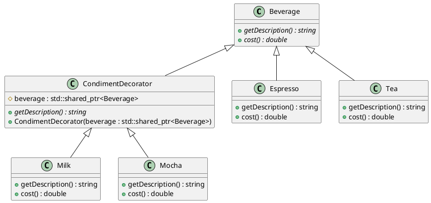

```plantuml
@startuml

class Beverage {
    {abstract} +getDescription() : string
    {abstract} +cost() : double
}

class Espresso {
    +getDescription() : string
    +cost() : double
}

class Tea {
    +getDescription() : string
    +cost() : double
}

class CondimentDecorator {
    #beverage : std::shared_ptr<Beverage>
    {abstract} +getDescription() : string
    +CondimentDecorator(beverage : std::shared_ptr<Beverage>)
}

class Milk {
    +getDescription() : string
    +cost() : double
}

class Mocha {
    +getDescription() : string
    +cost() : double
}

Espresso -up-|> Beverage
Tea -up-|> Beverage
CondimentDecorator -up-|> Beverage
Milk -up-|> CondimentDecorator
Mocha -up-|> CondimentDecorator

@enduml
```