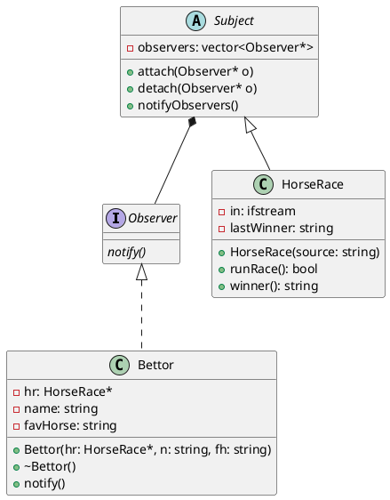

```plantuml
@startuml

interface Observer {
    {abstract} notify()
}

abstract class Subject {
    -observers: vector<Observer*>
    +attach(Observer* o)
    +detach(Observer* o)
    +notifyObservers()
}

class HorseRace {
    -in: ifstream
    -lastWinner: string
    +HorseRace(source: string)
    +runRace(): bool
    +winner(): string
}

class Bettor {
    -hr: HorseRace*
    -name: string
    -favHorse: string
    +Bettor(hr: HorseRace*, n: string, fh: string)
    +~Bettor()
    +notify()
}

Subject <|-- HorseRace
Observer <|.. Bettor
Subject *-- Observer

@enduml
```