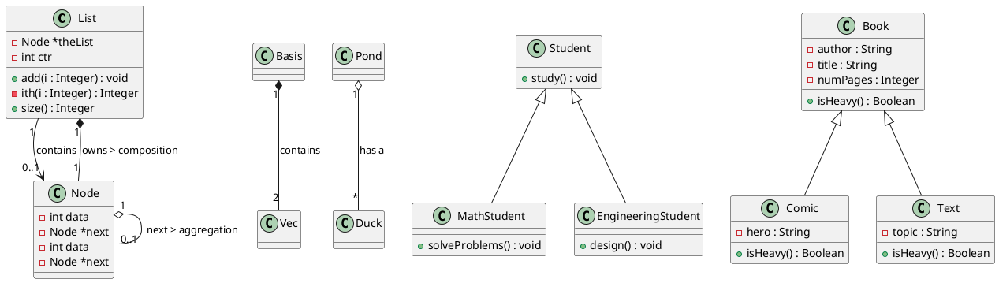

```plantuml
@startuml

class List {
  -Node *theList
  -int ctr

  +add(i : Integer) : void
  -ith(i : Integer) : Integer
  +size() : Integer
}

class Node {
  -int data
  -Node *next
}

List "1" --> "0..1" Node : contains

class Basis {
}

class Vec {
}

Basis "1" *-- "2" Vec : contains

class Pond {
}

class Duck {
}

Pond "1" o-- "*" Duck : has a

class Student {
  +study() : void
}

class MathStudent {
  +solveProblems() : void
}

class EngineeringStudent {
  +design() : void
}

Student <|-- MathStudent
Student <|-- EngineeringStudent


class Node {
  -int data
  -Node *next
}

List "1" *-- "1" Node : owns > composition
Node "1" o-- "0..1" Node : next > aggregation

class Book {
  -author : String
  -title : String
  -numPages : Integer
  +isHeavy() : Boolean
}

class Comic {
  -hero : String
  +isHeavy() : Boolean
}

class Text {
  -topic : String
  +isHeavy() : Boolean
}

Book <|-- Comic
Book <|-- Text


@enduml
```